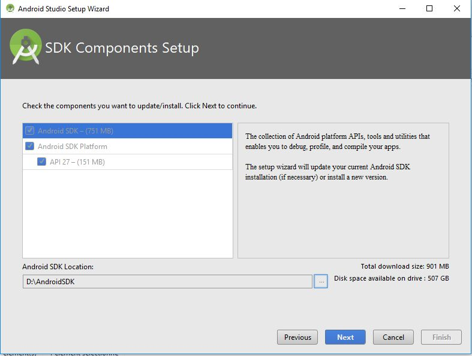
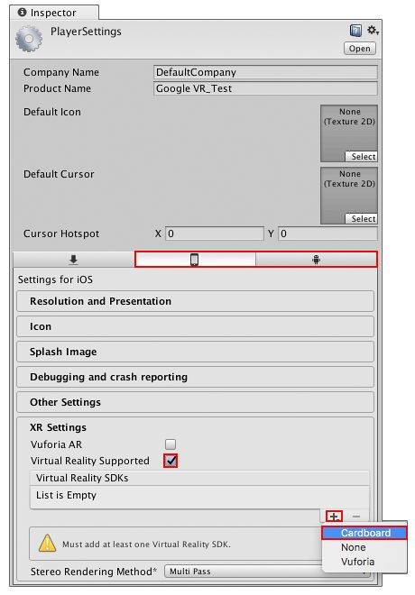

## Piscine VR Mobile -- Introduction

## Bienvenue dans la piscine VR Mobile.
Cette piscine a pour objectif de vous permettre d'acquérir les bases de la VR avec les Google Cardboard.
Pendant les 3 premiers jours, nous travaillerons sur Unity (en C#) pour vous donner les prémices de ce qui nous servira pendant les 3 jours suivant à travailler sur les Google cardboard.
Si vous avez des questions ou des remarques, n’hésitez pas à intervenir.

## Installation des outils:
- [Unity 2017.3.0](https://unity3d.com/get-unity/download/archive)
- [Visual Studio Community 2017](https://www.visualstudio.com/downloads/)
(Pensez à cocher la case télécharger les plugins pour Unity)
Vous pouvez choisir un autre éditeur, vous pouvez d’ailleurs télécharger Visual Studio Professional en récupérant une licence sur console.bocal.org)
- [Git Bash](https://git-scm.com/downloads)
- [Python](https://www.python.org/downloads/)
- [blih (version dump 2017)](https://gitlab.com/EpitechContent/dump2017/blob/master/blih.py)

## Installation de Android Studio:
Afin de construire, vous avez besoin [Android SDK et Java jdk8](http://www.oracle.com/technetwork/java/javase/downloads/jdk8-downloads-2133151.html) sur votre ordinateur  
Quelques détails pour les étapes du lien ci-dessous:
- Pendant l'installation si vous n'avez pas d'installation Android SDK,
il vous demandera un chemin et une version du SDK, n'oubliez pas de l'installer.
Unity demandera ce chemin!

Suivez ensuite les étapes suivante:
https://docs.unity3d.com/Manual/android-sdksetup.html
(L’étape 6 est facultative)

Téléchargez ensuite la dernière version de GoogleVRForUnity *. Unitypackage à partir de la page des versions.
https://github.com/googlevr/gvr-unity-sdk/releases

### Dans Unity
- Sélectionnez Assets -->Import Package → Custom Package
- Sélectionnez le fichier GoogleVRForUnity_.Unitypackage que vous avez téléchargé.
- Dans la boîte de dialogue Importer un package, cliquez sur Import.
- Acceptez toutes les mises à niveau de l'API, si vous y êtes invité.
- Configurez les paramètres de construction et les paramètres du lecteur:
    - Sélectionnez `File → Build Settings`.
    - Sélectionnez Android et cliquez sur Switch Plateform
    - Configurez les paramètres suivants:
        - `Edit → Project Settings → Player → Other Settings → Color Space → Gamma
        Edit → Project Settings → Player → Other Settings → Minimum API level → Cardboard: Android 4.4 'Kit Kat' (API level 19) higher`  
       - `Edit → Project Settings → Player → Other Settings → Cocher Virtual Reality Supported (Voir l'image ci-dessous)`
        `Paramètres XR → SDK Virtual Reality → Ajouter Cardboard (Voir l'image ci-dessous)`

### Méthode de rendu:
Le rendu se fera sous blih. Votre programme sera d’abord vérifié par une moulinette. Il est donc impératif que :
- Le nom du répo soit correct
- Les droits de lecture soient appliqués à christian.chaux@epitech.eu
- Les consignes de rendu données en fin de page soient respectées

Il vous faudra ensuite uploader une clé ssh. Pour cela veuillez suivre les étapes suivantes :
- Ouvrez Git Bash
- Tappez ‘ssh-keygen.exe’
- Ouvrez l’invite de command Windows
- Tappez ‘blih -u [Mail Epitech] sshkey upload [Path vers la clé .pub]’
- Vous pourrez ensuite tester si l’envoi de clé a réussi en entrant la commande suivante:
- `ssh git@git.epitech.eu`

### Norme:
Nous avons également décidé d’instaurer une norme pour cette piscine.  
Voici le détail de cette dernière :

- Vous commencerez avec une note de 100 qui diminuera selon les infractions commises :

- Utilisation de la class Process (-2147483648): La class Process permet de démarrer ou d’arrêter des processus. Vous n’aurez jamais besoin de cette class. De plus, son utilisation pourrait entraîner des effets néfastes sur l’ordinateur qui fait tourner les moulinettes.

- Utilisation de la du namespace System.IO (-2147483648): Les classes dans le namespace System.IO vous permette d’écrire dans des fichiers ou d’en supprimer. Vous êtes cependant autorisé à utiliser les exceptions de ce namespace mais ne faîtes pas de using System.IO

- N01: Pas de gitignore adapté (-1 par fichier invalide): Les moulinettes se font toutes une par une, clonant d’abord l’intégralité de chaque répertoire. Des fichiers inutiles ralentissent les moulinettes.
Vous êtes invité à télécharger le gitignore suivant et à le placer dans chaque exercice: https://github.com/github/gitignore/blob/master/Unity.gitignore

