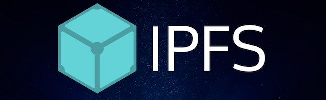

<div></div>
<div style="text-align:center" ></div>

# Blockchain Pool Day 4

## Rendu

 Nom du repo: `bc_pool_4`.
 
 Droits : `rotaru_i` et `guyard_r` en `r`.
 
 Ne pushez pas vos `node_modules`.
 
 `npm install` sera lancé avant l'exécution de votre exercice, veillez à avoir un `package.json` correct.
 
 Vous avez le droit uniquement aux modules s'installant via npm, et aux fonctions JS basiques.

## Introduction

#### Truffle

<a href="http://truffleframework.com/docs/"><div style="text-align:center" ></div></a>

Truffle est la meilleure suite d'outils de développement de Smart Contracts et de Dapps Ethereum. Il permet de facilement déployer et tester des Smarts Contracts, et propose des Box avec des packager et framework web connus (webpack / react).
 

#### Ganache et Ganache-cli

<a href="http://truffleframework.com/ganache/"><div style="text-align:center" ></div></a>

Ganache permet de lancer une Blockchain de test et de générer une certaines quantité de Wallets pré-alloués. Il vous suffira ensuite de lier votre application sur le même port que Ganache pour pouvoir communiquer avec la Blockchain comme nous le faisions hier.

[Ganache-cli](https://www.npmjs.com/package/ganache-cli) est la version cli, vous devriez plutot utiliser cette version car elle log toutes les requêtes effectuées sur son port ouvert, donnant ainsi une meilleur vision de ce qu'il se passe.

#### Metamask

<a href="https://metamask.io/"><div style="text-align:center" ></div></a>

Metamask est **LE** plugin web le plus util aux Dapps. Totalement client-side, il s'occupe de gérer des Wallet et créer des fenêtres de validation lors de tentatives de transaction. Il s'occupera aussi d'injecter Web3 dans le browser.

Lors de vos tests, faites pointer Metamask sur votre instance Ganache-cli, et chargez via la clé privée un Wallet crée par Ganache.

Vous pouvez aussi récupérer les clés privées des Wallets générés par Ganache-cli, et les charger dans Metamask.


### IPFS

<a href="https://ipfs.io/"><div style="text-align:center" ></div></a>

IPFS est le couteau suisse du stockage décentralisé. L'objectif sera de l'utiliser le plus possible lors de nos applications. Lorsque les applications Truffle React seront prêtes, il nous suffira de les build et de les ajouter à IPFS pour qu'elles deviennent accessible dans le browser de n'importe quel personne connectée à Internet. Nous n'avons donc pas besoin d'un serveur pour serve notre app, il nous suffira d'avoir un noeud IPFS.


#### Exercice 1: Graphical Basic MultiSig Wallet (0-20 pt)


Vous l'avez compris, l'objectif de la journée est d'utiliser les outils de développement correctement pour deploy une Dapp autour du Smart Contract que nous avons écrit hier. Si vous n'avez pas fini l'écriture du Smart Contract, je vous invite à revenir dessus.

Vous devrez donc développer votre application via Truffle React, utiliser Metamask dans le browser pour gérer les Wallets et les Transactions et utiliser Ganache-cli comme Blockchain.
Le tout doit être dans un dossier `GBasicMultiSigWallet`, et devra se build en lançant les commandes suivantes :

```
$ truffle compile
$ truffle migrate
$ npm run build
$ cd build_webpack/ && python -m SimpleHTTPServer 8000
```

Dès demain nous commenceront le développement de PocDapps, un ensemble de Dapps reliées entre elles, vous devez donc vous préparer dès aujourd'hui à l'utilisation de ces outils !
