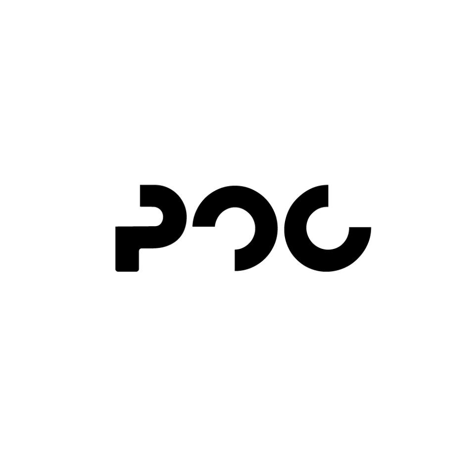
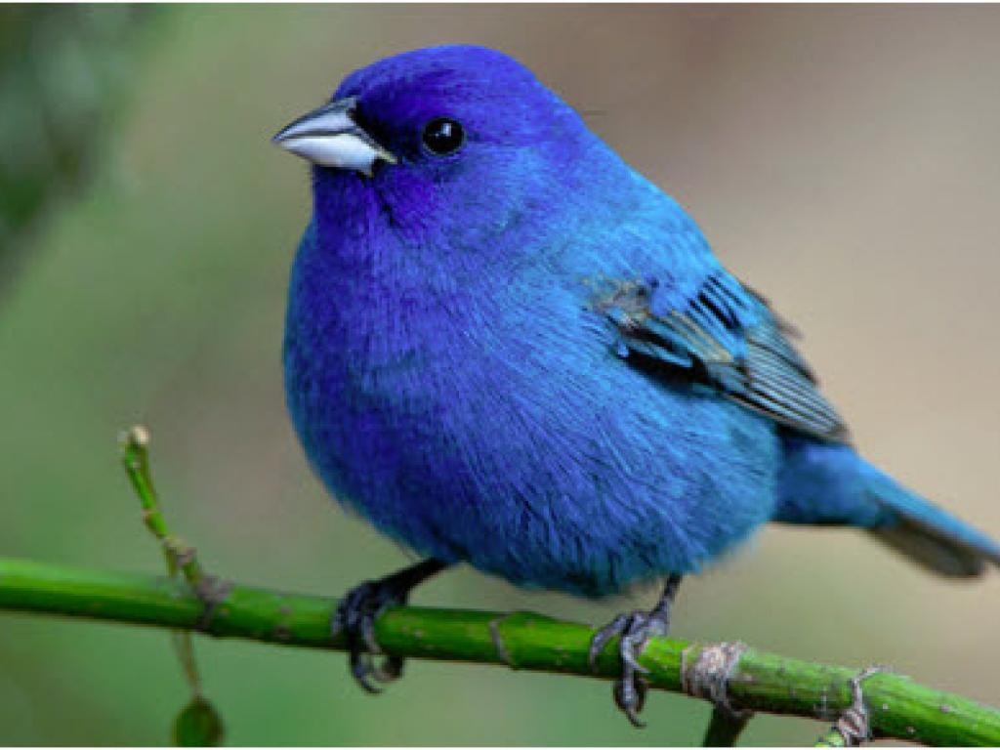
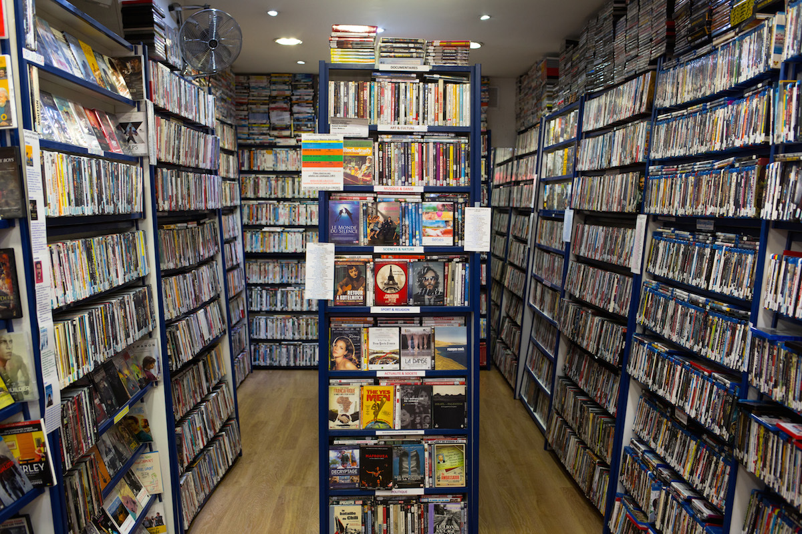
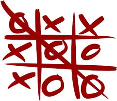

# PoCDapps

Le projet PoCDapps a pour but de créer un ensemble de services décentralisés.

## Introduction

Par petits groupes, nous allons mettre en place chaque service. Chacun de ces services devra utiliser le Core qui s'occupera des identités et qui est déjà construit.
Vous devez donc gérer l'identité des utilisateurs via le Core.

## Core

Le Core est la partie principale de PoCDapp, qui s'occupe de l'identité des utilisateurs.

Vous travaillerez sur vos propres branches dérivants de `dev`. Vous aurez donc l'intégralité du Core fonctionnel.

Vous devrez donc ajouter votre propre Migration de vos Smart Contracts, ainsi que l'ajout de l'addresse de vos Smart Contract dans le Smart Contract `Indexer` déjà déployé.

Inspirez vous du déploiement du Smart Contract `Identifier`.

Ensuite, lors de la mise en place de votre application, récupérez l'addresse de votre Smart Contract via l'`Indexer` que vous aurez au préalable rempli.

## Group Accounts

Ce service listera les MultiSigWallets de l'utilisateur et lui proposera une interface pour proposer des transaction, accepter ou refuser des transactions ou annuler ses transactions.

## Lotto

Ce service utilisera un Oracle pour récuperer un nombre aléatoire en dehors de la Blockchain. Il s'agit d'un système de Lotto simple, où le gain est la somme des couts des tickets. Vous êtes libres d'imaginer son fonctionnement en details.

## Cryptter

Un twitter version Blockchain, où chaque tweet est public, où l'on peut suivre des gens, chercher des gens à suivre. Le système est simple et tient en une page, pas de profile etc ... Il s'agit juste d'afficher un flux de messages dans l'ordre correspondant et de gérer les follows etc ...

## VidéoClub

Service le plus complexe, il faudra mettre en place un système d'enregistrement de vidéo et de streaming de vidéo sur une machine du Hub. Lors de l'upload, l'utilisateur choisi un cout de lecture. Pour visionner les vidéo il faudra donc payer ce cout pour pouvoir voir la vidéo en streaming dans son browser.

## Morpion

Mettre en place un système de morpion, avec des parties à durées non déterminées. Un cout d'entrée, le gagnant récupère son cout d'entrée et celui de l'adversaire.

## The Map

Une map de 1920*1080, ou chaque pixel est achetable. Le challenge ici est la façon avec laquelle l'utilisateur va pouvoir acheter des pixels en groupe pour y mettre une image. Plus il y'a de pixels achetés, plus les suivants coutent cher.

## Poll

Un système de vote sur des sujets totalement définissables par l'utilisateur. Il peut choisir le nombre de réponse et leur contenu.

